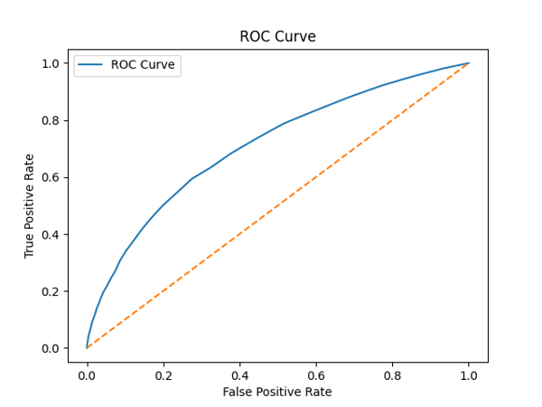
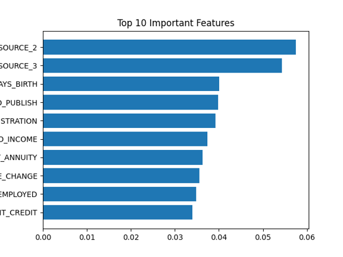
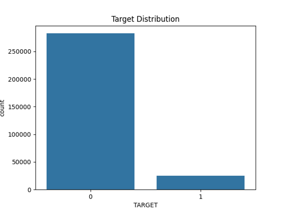

# 💳 Credit Risk Prediction using Machine Learning

## 📌 Overview
This project builds a machine learning model to predict whether a customer will default on a loan using financial and behavioral data. It is based on the **Home Credit Default Risk** dataset and focuses on identifying high-risk applicants to support better financial decision-making.

---

## 🎯 Problem Statement
Financial institutions face significant losses due to loan defaults. The goal of this project is to:
- Predict the probability of loan default
- Identify key risk factors
- Improve decision-making using data-driven insights

---

## 📊 Dataset
- **Source:** Home Credit Default Risk (Kaggle)  
- **Link:** https://www.kaggle.com/competitions/home-credit-default-risk/data?utm_source=chatgpt.com  
- **Size:** ~307,000 records  
- **Features:** 120+ (financial, demographic, behavioral)

---

## ⚙️ Approach

### 🔹 Data Preprocessing
- Removed irrelevant columns (e.g., ID)
- Handled missing values using median/mode imputation
- Dropped features with high missing values (>50%)

### 🔹 Encoding
- Converted categorical variables using One-Hot Encoding

### 🔹 Feature Engineering
- Created **Debt-to-Income Ratio** to better capture financial risk

### 🔹 Handling Imbalanced Data
- Used class weighting to address imbalance in default vs non-default cases

### 🔹 Model Training
- Train-test split: **80-20**
- Model used: **Random Forest Classifier**

### 🔹 Evaluation Metrics
- Accuracy
- Precision
- Recall
- F1-Score
- ROC-AUC Score

---

## 📈 Results

- The model successfully classified high-risk and low-risk applicants  
- ROC-AUC score indicates strong model performance  
- Random Forest performed better than baseline approaches  

### 📊 Visualizations

#### 🔸 ROC Curve


#### 🔸 Feature Importance


#### 🔸 Target Distribution


---

## 🔍 Key Insights

- Higher **debt-to-income ratio** increases default risk  
- Income and credit amount are strong predictors  
- Dataset imbalance significantly impacts model performance  
- Feature engineering improves predictive accuracy  

---

## 🛠 Tech Stack
- Python  
- Pandas, NumPy  
- Scikit-learn  
- Matplotlib, Seaborn  

---

## 📂 Project Structure

```
credit-risk-prediction-ml/
│
├── README.md
├── credit_risk_pipeline.py
├── requirements.txt
├── images/
│   ├── roc_curve.png
│   ├── feature_importance.png
│   └── target_distribution.png
```

## 🚀 How to Run

1. Clone the repository
git clone https://github.com/Harshitha-Somu/credit-risk-prediction-ml
cd credit-risk-prediction-ml


2. Install dependencies
pip install -r requirements.txt


3. Run the script
HomeCredit_CreditRisk_Prediction_V1


---

## 🔮 Future Improvements

- Integrate LLM-based explanations for predictions  
- Add model interpretability using SHAP  
- Deploy as a web application/dashboard  
- Experiment with advanced models (XGBoost, LightGBM tuning)  

---

## 🙌 Conclusion
This project demonstrates how machine learning can be applied to real-world financial data to predict credit risk, improve loan approval decisions, and reduce financial losses.

---
